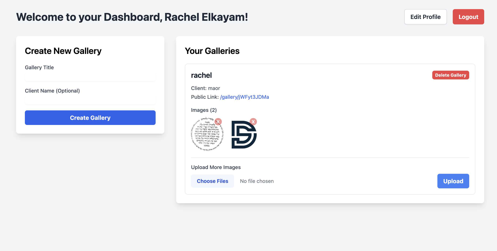

# 📸 Photographer's Media Gallery CMS

> A complete Full-Stack MERN application for photographers to securely manage and deliver **media galleries (images and videos)**.

## 🚀 Live Demo
https://photo-gallery.keinar.com

---

## 🖼️ Project Preview

---

## 📖 About This Project
This project provides a self-hosted, professional platform for photographers to deliver client galleries with secure access, **cloud media (images and video) hosting**, and an admin dashboard.

---

## ✨ Key Features
- Secure admin authentication with JWT
- Protected backend and frontend routes
- Profile management for the admin
- Gallery CRUD with unique, secret shareable links
- Cloudinary for **image and video storage** and Multer for uploads
- **Supports both image and video uploads**
- "Download All" generates a ZIP on-the-fly for clients (including both images and videos)
- Tailwind CSS frontend and responsive galleries

---

## 🛠️ Tech Stack
- Frontend: React, React Router, Tailwind CSS, React Toastify, Axios
- Backend: Node.js, Express.js
- Database: MongoDB (Mongoose)
- Auth: JWT, bcrypt.js
- Storage: Cloudinary (**for image and video assets**)
- Uploads: Multer
- ZIP: JSZip

---

## 🚀 Getting Started (Local Setup)

### Prerequisites
- Node.js (v18+ recommended)
- MongoDB Atlas or local MongoDB
- Cloudinary account

### 1. Clone the repository
```bash
git clone https://github.com/keinar/photographer-gallery.git
cd photographer-gallery
```

### 2. Backend setup

```bash
cd backend
npm install
```

Create a `.env` file in the backend directory with:

```env
MONGO_URI=your_mongodb_connection_string
JWT_SECRET=your_jwt_secret
CLOUDINARY_CLOUD_NAME=your_cloudinary_name
CLOUDINARY_API_KEY=your_cloudinary_key
CLOUDINARY_API_SECRET=your_cloudinary_secret
PORT=5001
```

Run the backend:

```bash
npm run dev
```

### 3. Frontend setup

Open a new terminal:

```bash
cd frontend
npm install
npm run dev
```

Frontend dev server typically runs at: http://localhost:5173

-----

## 4. Create an Admin User

Use Postman, Thunder Client, or curl to create a first admin user.

Example curl:

```bash
curl -X POST http://localhost:5001/api/users/register   -H "Content-Type: application/json"   -d '{"name":"Your Name","email":"admin@example.com","password":"your-secure-password"}'
```

After registering, log in on the frontend to obtain access to the admin dashboard.

-----

## 📦 Deployment Notes

  - Backend can be deployed on cPanel's Node.js selector or any Node-compatible host.
  - Ensure environment variables are set in your hosting environment.
  - Cloudinary credentials must be kept secret.

-----

## 🔧 Troubleshooting

  - If API calls fail, check backend logs and ensure the backend port matches the frontend API base URL.
  - Verify Cloudinary credentials and that images and videos upload/delete correctly.

-----

## ❤️ Contributing

Contributions, bug reports, and feature requests are welcome. Please open an issue or PR on the repository.
